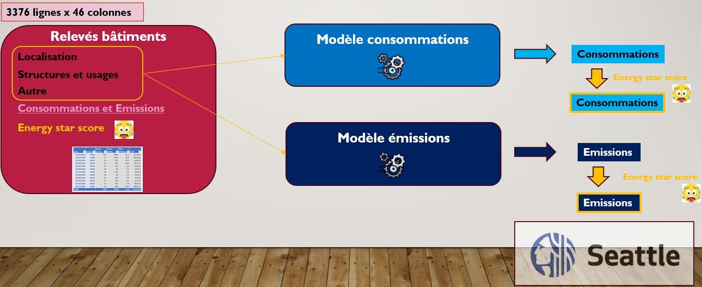

# ML-supervise-data_p4
Livrables réalisés pour le projet "Anticipez les besoins en consommation de bâtiments" (projet n°4) OpenClassroom.

### Contexte du projet de formation professionnalisant : 

Vous travaillez pour la ville de Seattle, qui vise la neutralité carbone d'ici 2050. Votre équipe s'intéresse aux bâtiments non résidentiels pour réduire les émissions.

**Problématique** :
Les relevés de consommation et d'émissions sont coûteux. Vous devez prédire les émissions de CO2 et la
consommation énergétique des bâtiments non mesurés, en utilisant les données structurelles (taille, usage, date de construction, etc.).

**Objectifs** :
Réaliser une analyse exploratoire des données de 2016.
Tester différents modèles de prédiction pour améliorer la précision des estimations.
Évaluer l'intérêt de l'"ENERGY STAR Score" dans la modélisation.

### Étapes :
* Analyse exploratoire :
 Examiner les données disponibles et identifier les variables pertinentes.
* Modélisation :
  Tester au moins 4 algorithmes de machine learning différents (ElasticNet, SVM, GradientBoosting, RandomForest).
  Éviter les fuites de données en utilisant uniquement des informations disponibles sans relevés futurs.
* Optimisation :
  Appliquer des transformations de variables (normalisation, logarithmes, etc.).
  Effectuer une validation croisée pour optimiser les hyperparamètres et les performances des modèles.

### Livrables :
* **Gamba_Lucas_1_notebook_exploratoire_022024** : Notebook d'analyse exploratoire des différentes variables
* **Gamba_Lucas_2_notebook_prediction_022024** : Notebook de sélection d'un modèle pour la prédiction des consommation énergétiques
* **Gamba_Lucas_3_notebook_prediction_022024** : Notebook de sélection d'un modèle pour la prédiction des émissions de Gaz à Effet de Serre
* **Gamba_Lucas_4_presentation_022024** : Présentation de la démarche incluant :
    * Un rapport détaillant l'analyse exploratoire, les modèles testés, et les résultats.
    * Une évaluation de l'utilité de l'"ENERGY STAR Score" dans les prédictions.
